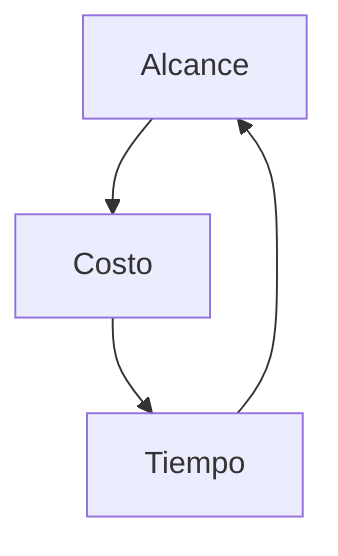
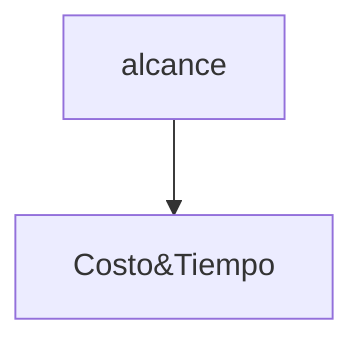

# Proyectos Ágiles
## Cómo comenzar un proyecto
### El deseo
Una presentación de lo que se quiere que se haga, sea factible o no, pero permiten encontrar las necesidades del cliente.

* Hasta dónde conocemos
* Necesitamos saber qué es lo que se necesita realmente
* Marcar una línea entre lo que el cliente quire, lo que necesita y lo que se puede hacer.
* Delimitar los requerimientos necesarios para la realización del proyecto

### Metodologías
Se debe __considerar__ el espacio de tiempo para tener claro cómo van a __arrancar__ y también sepan cómo se va a __preparar__.

Es importante __definir cómo__ va a ser la forma de entregar el __producto constantemente__. Hacer lo que se puede en el periodo de tiempo que se tiene.

### Definir el tiempo del proyecto
Definir hasta dónde se puede llegar. No podemos prometer lo que no pse puede hacer.

Es común no llegar al priducto final visualizado por el cliente, es importante no perder la línea de cual es el impacto a generar en el tiempo dado. 

El impacto comienza con la satisdacción del cliente. No pensar lo que no se puede hacer ni lo que es imposible de controlar.

#### Agilidad
La habilidad de adapptarse rápidamente, o incluso anticiparse al contexto y liderar un cambio. En el sentido más amplio, adecta al diseño estratégico, las operaciones, la tecnología y la innovacón.

## Tipos de proyecto.
* Repetitivos
: fábricas o líneas de ensamblaje.

* Únicos
: aquellos proyectos que ya existen y continuan creciendo y mejorando constantemente.

#### Calidad constante

Aprender cómo hago para que el proyecto de hoy tome menos tiempo que tiempo pasado, además de obtener más con un menor costo.

Mientras algo se encuentre en la fecha límite, el cliente está tranquilo. La realidad es que más del 80% de los proyectos únicos en estas condiciones no serán finalizados.

### Manejar el cambio
Cambiar la forma de pensar.
Cambiar la forma en la que se hacen las cosas.
Tener claro lo que se quiere.
Estrateguas.

### Metodología ágil
Es más dificil que la forma tradicional

Podrás ver los resultados desde el principio

Keep It Simple and Stupid -> KISS

Definir el tiempo y el costo, pero el alcance es variable, el producto final tiene tres posibles variables = __MÁS__, __MENOS__ o __IGUAL__

### Trabajar ágil
Trabajar conociendo la realidad de un proyecto y sacándole el mejor provecho

Trabajar en las personas 
* Metodología tradicional
: Trabajar o morir para alcanzar el objetivo.

* Metodología ágil
: trabajar con motivación debido a que la aplicación está pensada para que el usuario trabaje fácilmente

# Fase:  _Inception_

Agile inception Deck
: Comenzar el desarrollo de un producto de forma coherente, para mejorar el enfoque y generar un __impacto__.

## Necesidades
* Una idea
* Noción de qué se va a hacer
* Un presupuesto
* Las personas que saben del tema que se va a trabajar.

## Experiencia vs teoría
### Forma de trabajo
* Impact Mapping -> 4 hrs a 1 día de trabajo
* User story mapping -> 4 hrs a 1 día de trabajo

## Duración
### Depende
* Quién lo dirige
* Qué capacidad existe de llegar a las personas y sacar la información que necesitamos
* Qué conocimiento se tiene sobre el proyceto.

# Story Mapping

1. Something...
2. Priorizar

MUST -> Tiene que estar

SHOULD -> Debería estar

COULD -> Podría estar

WON'T -> No se puede 

3. Versiones

## Mitos
* Una vez se tiene, no cambia.
* Agregar un cambio o hacer una modificación no impacta en el tiempo y en el costo
* El detalle de cada actividad no puede variar
* Necesito tener todas las actividades estimadas

# SCRUM
Cuando todo el equipo se junta para avanzar como una sola unidad

## C A R

* Ceremonias -> Reuniones para acordar las distintas características del proyecto, así como las iteraciones y cómo se van a dividir las tareas para cada versión que se va a lanzar.
* Artefactos -> 
* Roles -> 

# Historias de usuario
## Card - El post it
### Historia < Acción del programa >
* Yo como < Usuario >
* Quiero < Acción >
* Para < Justificación >
* Puntaje < Estimación de dificultad >

El formato ayuda a que las personas que lo lean puedan saber de forma sencilla, puedan comprenderlo y generar dudas/retroalimentación. Y finalmente aceptarlo. Las historias de usuario describen la función hacia el usuario, mientras que los casos de uso se enfocan más en el software

## INVEST
* Independiente
* Negociable -> si no se puede alcanzar, se ajusta de acuerdo a la situación real.
* Valiosa
* Estimable
* Small
* Testeable

- > No está mal combinar casos de uso e historias de usuarios

## Patrones de diseño
MVC - Modelo Vista Controlador
MVP - Modelo Vista Presentador
MVVM - Modelo Vista Vista Modelo

# SCRUM
## Planeación
### Refinamiento (grooming)
Reducción de 
#### Estimación
Tamaño del trabajo que hacer, normalmente se mide en S, M y L
#### Análisis
Definición de Done y Ready
## Estructura

Backlog | Planed to do | Developed/Testing | Done
---------|----------|---------|---------
 | - | - | - | -
 | - | - | - | -
 | - | - | - | -

## Deuda técnica
Es aquellos problemas que estamos dispuestos a dejar sin solución en favor de avanzar el proyecto y que tiene que solucionarse más adelante. Es básicamente lo que metes bajo la alfombra. 
Son distintos de los bugs, un bug puede generarse por culpa de la deuda técnica, pero no a la inversa.

## Sprint review
Ceremonia que nos permite entregar al stacke holder nuestros avances, así como poner al día a los miembros del equipo sobre las cosas que se han llevado a cabo en el último sprint.

Es una forma de presentar avances fuera de las grandes presentaciones formales que permitan al equipo tener un desarrollo más holgado donde el cliente pueda mirar cómo funcionan la aplicación sin romper el avance y permitir demostrar los compromisos.

### Qué NO  es
* No es una presentaión de PP demasiado formal o extensiva que consume tiempo del development.

* Generar una falsa sensacion de competar con documentación

* Reunión donde el Product Owner sólo presenta a loa stakeholders

* Mentir sobre la realidad del proyecto en caso de no haber cumplido con todos los compromisos.

### Tips
No unficarlo con la restrospectiva

Seguir los pilares del SCRUM

* Transparencia
* Inspección 
* Adaptabilidad

## Retrospectiva
Qué hicimos bien
QUé hicimos mal
En qué podemos mejorar como personas, con las herramientas y los procesos.