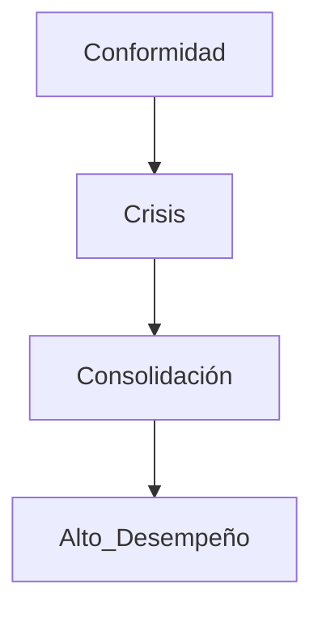

* Previo a las sesiones, lee. Al menos 5 páginas de cualquiera de los libors sugeridos

* Plantea y escribe tus preguntas, dudas, inquietudes, cuestionamientos sobre lo que leíste y/o sobre el tema de la sesión.

* Comparte tus preguntas al inicio de la sesión

* Lleva apuntes sobre las conversaciones de las sesiones.

- - -

#### **Qué es el alto desempeño?**

* Cuando nosotros como equipo logramos cosas queno pensamos que fuéramos capaces.

Atrasar la toma de decisiones tiende a alentar la evolución del departamento y restringe nuestra toma de decisiones.

#### Cómo encontrar el momento correcto para actuar?

* Primero hacer y cotejar con la información dada si nuestra decisión fue la correcta, es más fácil corregir que comenzar a hacer una vez tenemos toda la información.

#### Cómo queremos que sea nuestra forma de trabajo como oficina?

*La industria no siempre tiende a reflejar las mejores prácticas, por lo que es necesario aprender a manejarnos nostrosos mismos, aprender a llevar nuestras oranizaciones y no depender de que otros lleguen a decirnos qué hacer.

#### Principios de una oficina ágil y diciplinada

* Delight customers - Superar las expectativas y deleitar a los clientes con nuestro trabajo

* Choice is good - entre más opciones se tengan sobre cómo hacer las cosas es mejor

* Context counts

* Pragmatism

* Be awesome

* Enterprise awareness - tenemos autonomía dentro de las restricciones de la organización

* Optimize flow - optimizar todos los procesos que podamos. Que uno de los engranajes sea eficiente, no quiere decir que todo el proyecto vaya a mejorar.

No siempre los equipos que trabajan de forma ágil terminan siendo eficientes, el modelo [LEAN](https://www.apd.es/metodologia-lean-que-es/) es el que más resultados ha ofrecido.

#### Nuestras responsabilidades (individuales)

* Producir soluciones que satisfacen a nuestros socios formadores e interesados.

* Optimizar recursos

* Colaboración extensiva y con otros equipos

* Compartir información

* Transmitir habilidades

* Validar nuestro trabajo tan pronto como sea posible

* Incrementar nuestras hbilidades

* Asistir a las juntas y sesiones puntualmente.

* Activamente mejorar el desempeño del equipo

#### Roles departamentales
##### Coache
Proveer diciplina, habilidades y experienca para el desarrollo

Apoyar y motivar a los equipos

##### Program manager

Asegurar que los proyectos sean exitosos

Utilizar los talentos de todos los integrantes del equipo

##### Software Engieniering Group

Aquellos que se encargan de codificar el proyecto y llevarlo a cabo

#### Roles DAD (Diciplined Agile Delivery)

##### Lider del equipo (Team Lead)

* Experto en el proceso

* Mantiene al equipo engocado en lograr los objetivos

* Remueve los impedimentos

##### Dueño del producto (Product Owner)

* Dueño de la visión del producto, alcance y prioridades de la solución

##### Dueño de la arquitectura (Arquitecture Owner)

* Dueño de las decisiones de arquitectura y prioridades tecnicas

* Mitiga los riesgos técnicos principales

##### Miembro del equipo (Team Member)

* Miembro multifuncional del equipo que entrega la solución

##### Stakeholder

* Cualquier interesado en el proyecto

#### Cómo podemos lograr el alto desempeño?

##### Trabajo en equipo: 

* Un grupo de personas que han decidido seguir un método común de trabajo para lograr un obketivo que es relevante, de manera que cada miembro del equipo se esiente comprometido personalmente con el éxito de todo el equipo

##### Evolución de los equipos

##### Características de los buenos equipos

La mayoría de los miembros de equipo deben ser _Especialistas generalistas_ 
* También se les conoce como _T-skilled people_.

* Se un especialista generalista hacemás fácil la colaboración.

##### Características de los buenos miembros de equipo

* Auto-diciplinados: Sólo se comprometen con el trabajo que pueden lograr y hacer el trabao de la manera más efectiva posible

* Auto-organizados: Estiman y planean su propio trabajo y luego proceden a colaborar de manera iterativa para ahcerlo.

* Concientes ded sí mismos: Buscan identificar qué es lo que funciona para ellos y qué no, y posteriormente aprenden y hacen los ajustes necesarios.

##### Estrategias para los buenos  equipos efectivos

* Son enfocados

* Se adaptan al ambiente

* Se basan en la confianza y el respeto

* Seguros (comunicación abierta, honesta y empática)

* Proveén de oportunidades de aprendizaje

* Lo más pequieños posibles

* Comparten un lugar de trabajo

* Están completos (en cuestiones de habilidades)

* Se organizan de manera autónoma dentro de las restricciones de la organización

* Tienen los recursos adecuados para cumplir con su misión

* Son responsables de lograr sus objetivos

* Son conscientes de la organización

* Incluyen gente dedicada

* Geográficamente cerca

* Siguen en una estrategis común

* Se mantienen juntos
