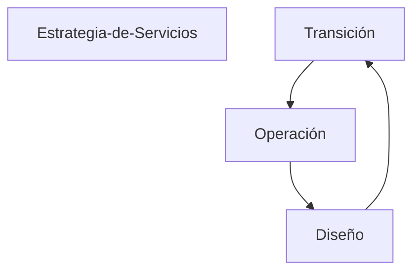

# Qué es calidad?
Es una propiedad de cualquier cosa que permite que la misma sea comparado con cualquier cosas de su misma especie. Es la percepción que tienen las personas sobre un producto.

# Qué es un estándar?
Se utiliza para nombrar a aquello que puede nombrarse como:
* Referencia

* Patrón

* Modelo

Los estándares son especificaciones acerca de cómo debe desarrollarse una tarea o función determinada y están basadoes en acuerdos entre una o más entidades o un determinado grupo de personas de forma internacional

-- | Metodologías | Modelos | Estándares | Marco de referencia | Buenas prácticas
---------|----------|---------|---------|---------|---------
 Ventajas | Proporciona eficiencia en el desarrollo de los procesos | Proporciona varias opciones para basarse al iniciar un proyecto | Proporciona calidad al proceso de desarrollo de un proyecto | Proporciona un punto de partida para el desarrollo | Proporciona una serie de consejos y normas para hacer más fácil de entender los procesos de desarrollo
 -- | En los casos de éxito el tiempo empleado es poco | El tiempo empleado no tiene mayor relevancia | El tiempo empleado no tiene relevancia | Proporciona varios puntos de vista | Al hacer uso de las buenas prácticas, cualquier persona puede entender la finalidad de x proceso o proyecto
 -- | Los resultados son eficaces | El trabajo en equipo se puede realizar pero no es indispensable | -- | -- | --
 Desventajas | En la mayoría de los casso no cumple con el tiempo esperado | Depende directamente de la planificación del proyecto | Son obligatoriospara desarrollar software de calidad | Al tener varios puntos de vista, las decisiones que se tomarán pueden ser subjetivas | Ninguna
 -- | Depende del trabajo en equipo para cumplir el objetivo | **Falta** | **Falta** | -- | --

# Madurez
Con base en la experiencia, se corrigen desperfectos, se aprenden de los errores y esos conocimientos se aplican para ir mejorando los procesos.

## Modelo ITIL (v.3)
### Mejora contínua del servicio

#### Transición VS Cambio
**Transición** | **Cambio**
-----|-----
Paulatino | Radical

#### Operación
* Las bondades y propiedades del producto

* NO mencionar el precio como un bonus

* La sostenibilidad y versatilidad del producto, así como su capacidad de responer en caso de fallas

#### PMI VS CMMI

CMMI | PMI
----|----
Está enfocado en el desarrollo del proyecto | Está enfocado en la manejo del proyecto

#### CMMI
##### Madurez
1. Inicial
    - No significa que la organización es capaz de producir buen software. 

2. Gestionado (_Hacer que las cosas pasen_)
    - El proceso está bajo un control administrativo básico.
    - Proceso diciponado
    
3. Definido
    - Procesos documentados, estandarizados y congruentes
    - Proceso estándar

4. Cuantitatico
    - Objetivos de calida dpara el producto y el proceso
    - Proceso predecible

5. Optimizado
    - Mejoras con el tiempo y marcas los estándares de la industria
    - Mejoramiento contínuo

##### Control de calidad VS Aseguramiento de calidad

Control de calidad | Aseguramiento de la calidad
----- | -----
Evalúa el producto | Evalía el proceso del producto

## Características de calidad (De acuerdo al profesor)
### Funcionabilidad (Functionality)
Adecuación (Sustainability)
* El conjunto de funciones necesarias para ejecutar la tareas especificadas está presente

Precisión (Accuracy)
* Los resutlatdos o efectos obtenidos son correctos o son acordados

Interoperabilidad (Ineroperability)
* Capacidad de interactuar con los sistemas especificados

Cumplimiento (Compliance)
* Se adhiere a los estándares o convencionales relativos a la aplicación, así como los reglamentos y otras prescripciones legales.

Seguridad (Security)
* Impide el acceso no autorizado, ya sea accidental o deliberado a los programas y a los programas y a los datos

### Confiabilidad (Reliability)
Madurez (Madurity)
* Frecuencia con que el software falla por contender defectos

Apredizaje (Learnability)

### Mantenibilidad (Mainteinability)
Modificalidad (Changeability)
* Esfuerzo necesario para modificar, remover defectos o hacer cambios de ambiente

Analizabilidad (Analyzability)
* Esfuerzo necesario para diagnosticar las deficiencias o causas de las fallas o para identificar las partes que deben ser modificadas

Estabilidad (Stability)
* 

### Portabilidad (Portability)
Adaptabilidad (Adaptability)
* Oportunidad para adaptar la aplicación a diferentes especificaciones de ambiente

Instalabilidad (Instalability)
* Esfuerzo necesario para instalar el software en un ambiente especificado

Conformidad (Conformance)
* Se adhuere a los estándares y convenciones relacionadas con la portabilidad

Reemplazabilidad (Reemplaceability)
* Oportunidad y esfuerzo para usar la aplicación en lugar de otro software en el ambiente especificado para él.

Active directory: Es donde se almacenan los usuarios y contraseñas