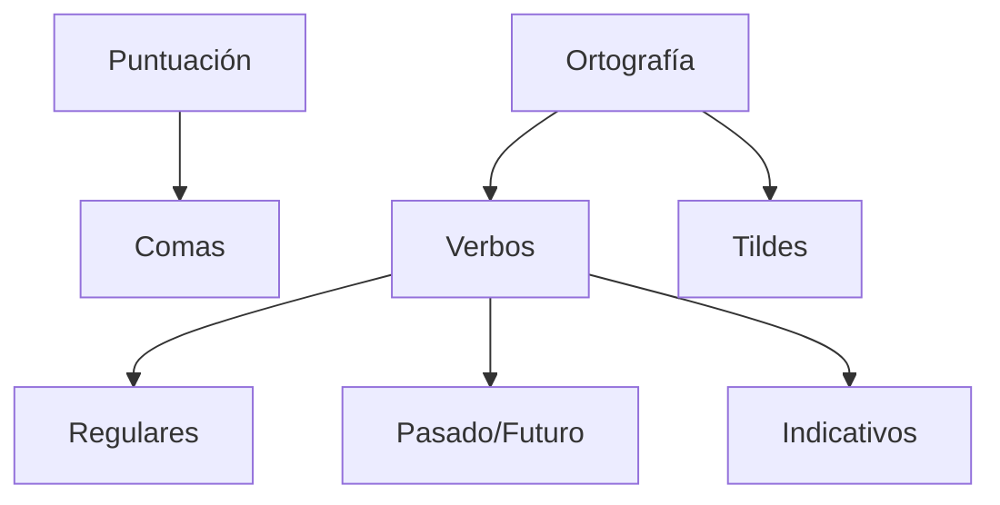
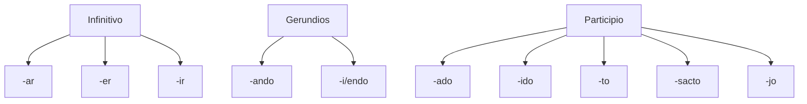
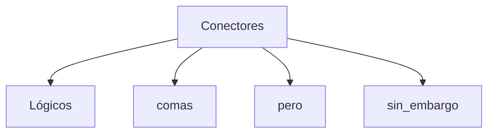
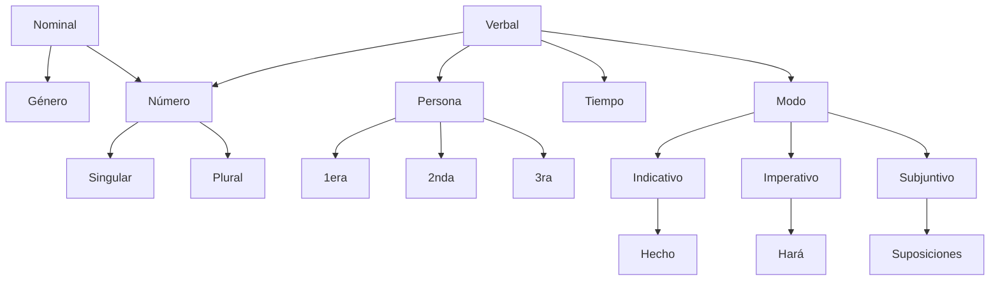

## Errores
### Puntuación y ortografía

### Uso de verbos
Perífrasis verbales innecesarias

Verbos y Verboides

Palabras que necesitan sinónimos:
* Poder
* Lograr
* Intentar
* Comenzar
* Decidir

### Muletillas
**Muletillas** (en general)

### Silepsis (falta de concordancia gramatical)
Cuando mencionas que vas a encontrar una cosa, pero dices varias:

    Un ejemplo, *menciona varias cosas*

### Propiedad del lenguaje
Tener en cuenta el contexto
* Usuario
* Lector

Ambos necesitan distintas formas del lenguaje que dependen de a quién te enfrentas.

## Buenas prácticas
* Corrección

* Consición

* Claridad

* Coherencia

* Control

## Por qué?
* Por qué ¿? ¡! --> Pregunta

* Porque --> Respuesta

* [El] Por qué

* Por [lo] que