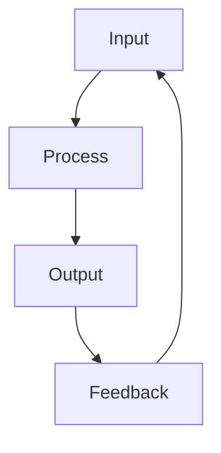
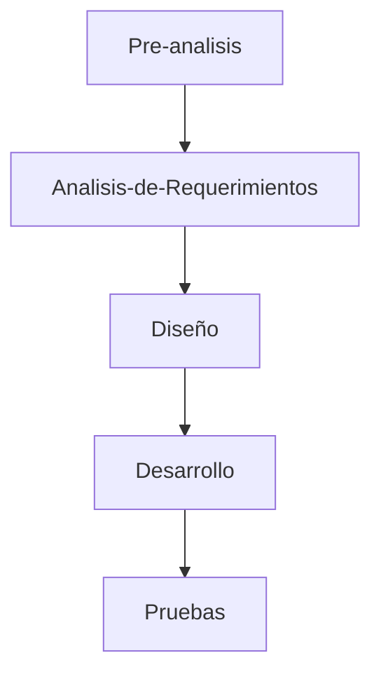

Rol | Responsabilidad | Liderazgo
----|----|----
Actividades que un individuo debe realizar | Comportamientos y obligaciones que se esperan de una persona | Capacidad que tiene una persona para influir, organizar y  motivar a otras personas

## SEPG/Cepillines (SOftware Engineering Process Group)
### PI Champion
Encargado de las relaciones públicas del equipo

### Engineering Process Group Lead
Esta persona lidera el grupo y toma las decisiones (democráticamente para el proyecto)

### EPG Members
Sirven como miembros de comité, son responsables de garantizar que la documentación de  mejora de procesos se escriba y se siga. También son responsables de generar métricas para rastrear elproceso de mejora de procesos.

### Transition Partner(s)
Fungen como consultores externos para apoutar en la conficutación, planificación y supervisión del proggreso en la implementación de las mejoras de los procesos que representa el software desarrollado. APortan experiencia en la mejora del procesos en otros proyectos.

### Software Quality Control (SQC)

### Software Quality Assurance (SQA)
Audita los procesos de trabajo para identificar deficiencias. Determina el pcumplimiento del plan de desarrollo del proyecto y del proceso de desarrollo.

#### SQC VS SQA
Desarrollo de calidad | Aseguramiento de calidad
----|----
Detectar los problemas en el código del programa | Detectar los problemas en los procesos 

## Procesos
Una secuenciade pasaos dispuesta con algún tipo de lógica que se enfoca en lograr algún resultado específico.

Los procesos son mecanismos de comportatmiento que diseñan los humanos para mejorar la productividad de algo, para establecer un orden o eliminar algún tipo de problema

### Características de un proceso
* Pueden sermedidos y están orientados al rendimiento

* Tienen resultados espec´ficos

* Entregan resultados a clientes o "stakeholders"

* Responden a alguna acción o evento específico

* Las actividades deben agregar calor a las entradas del proceso

### Procesos de negocio
Pueden ser vistos como un recetario para hacer funcionar un negocio y alcanzar las metas definidas en la estrategia de negocio de la empresa

Hay dos formas de verlos

Vista funcional | Vista de procesos
----|----
Se enfoca en la forma en la que las acciones tomadas presentan un resultado | Se enfoca en la forma en la que se hacen las cosas y los resultados que se obtienen

El análisis de esos procesos permite mejorar la efectividad operativa y establecer acciones para mejorar el rendimiento. Debe ser contar con procesos medibles, eficientes y alineados con las estrategias empresariales.

### Objetivo general
El proceso cuando es definido y documentado, permite que pueda ser gestionado para soportar las variaciones que se presenten y poder tomar acciones que mejoren los resultados esperados.

El proceso no es lo que se dice que se debe hacer, es lo que realmente se hace.

### Business Process Management (BPM)
* Modelar y diseñar los procesos

* Automatizar e integrar la información y las tecnologías para monitorear y mejara contínuamente los procesos  y los resultados

Con el cambio de enfoque se gusta lograr llegar a la gestión de procesos

### Procesos en desarrollo de software
El proceso de desarrollo de software propuesto está basado en el ciclo de vida incremental ya que combina elementos del modelo en cascada aplicado en forma iterativa y aplica secuencias lineales de manera escalinada conforme avanza en el tiempo

Además se basa en el comportamiento del modelo espiral, el cual realiza el análisis de los riesgos al final de cada iteración de desarrollo, y con base en el resultado de este análisis se realiza el plan en cada incremento.

