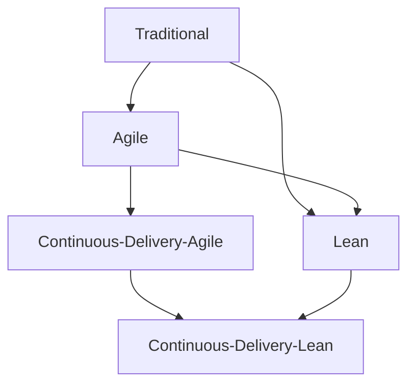
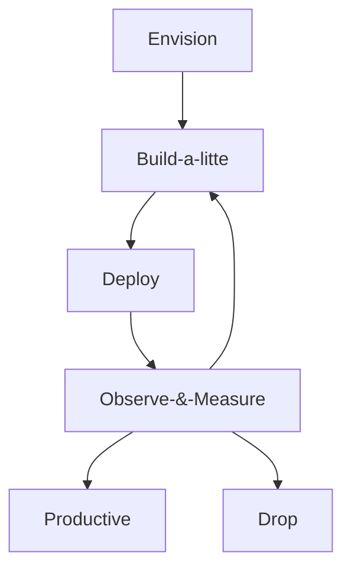

# Mejora del cliclo de vida

**Cómo DAD extiende SCRUM**: Cambia la organización del trabajo y una arquitectura más fuerte para soportar los requisitos no funcionales. Además de que los entregables DAD son consumibles, funcionalbles, utilizables y deseables (los usuarios quieren usarlas)

## Ciclo de vida LEAN
* Prioriza las actividades, además de que gestiona más eficiente las actividades que se tienen que dar prioridad
    - Business value

    - Expedite

    - Fixed delivery date

    - Intangible options

* Se detiene producción cada vez que se tiene una mejora en el producto.

## Ciclo de vida Lean Startup

## Dicipline Agile Delivery
* Primero están las personas:

* Orientado a objetivos

* Híbridamente ágil

Inception | Construction | Transition
---------|----------|---------
 Form Team | Prove Architecture Early | Ensure Production Readiness
 Align wit enterprise direction | Address Changing Stakeholders needs | Deploy the solution
 Explore scope | Produce Potentially Consumable Solution | -
 Identify Architecture Strategy | Improve Quality | -
 Plan the realese | Accellerate Value Delivery | -
 Develip Test Strategy | - | -
 Develop Common Vision | - | -
 Secure funding | - | -

### Milestones
* DA define un conjunto de milestones para asegurar que el riesgo de los proyectos está bajo control

* Estas milestones permiten gobernar cualqier proyecto aunque su wow sea diferente

* En muchas organizaciones revisar las maliestones es costosso y poco práctico, por los que deben hacerse de forma ligera.

* En caso de que las milestones no se cumplan, hacer cambios

**Cómo se evalua el WoW?**: Comparando nuestro desempeño contra las formas de trabajo de proyectos exitosos y proyectos que terminaron en fracaso.

**Cómo sabemos que estamo listos para cambiar de fase?**
* Logramos la milestone

* Identificamos riesgos tolerables

* Los equipos están listos para el trabajo colaborativo

#### Patrones exitosos en la fase de inicio
* Corta y suficiente (4 semanas)

* Estimaciones en rangos (No es posible determinar con exactitud la plaeación, costo y alcance, sin impactar demanera negativa la calidad) _Regla de dedo, si no tenemos una estimación inicial, hacer una y multiplicarla por dos; si es nuestra primera vez, multiplica por tres_

* Documentación mínima pero suficiente

#### Anti-patrones de la fase de inicio
* Sin apoyo para el desarrollo de habilidades

* SIn apoyo para instalaciones dedicadas

* Prácticas de administración de proyectos autocráticas (hay un tirano)

* Saltar directamente a la fase de contrsucción

* Productos de trabajo sobredetallados

* Parálisis de análisis

### Work Breakdown Structure (WBS)
Es una manera jerárquica de organizar el trabajo y permitir estimar el esfuerzo del trabajo que se tenga.