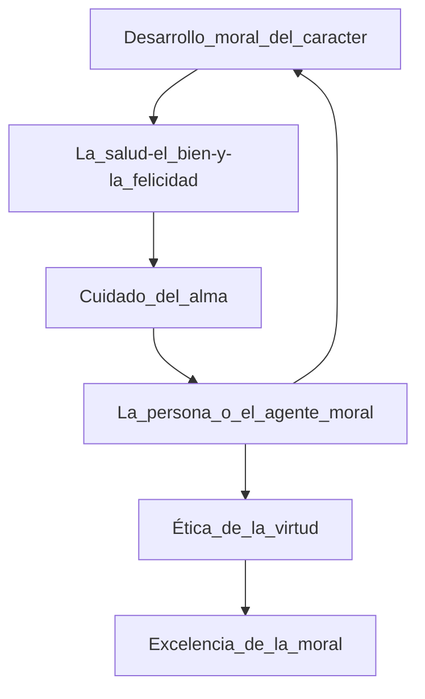
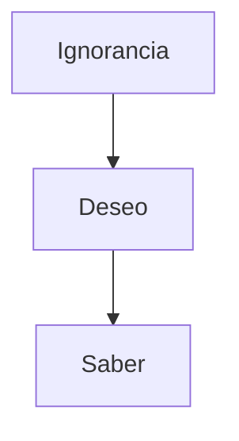

## La psique

1. El aliento (del griego)
2. Ser y hacer.

## ¿Qué es la psicología?

Explica por qué algunas cosas se dan de diferente forma debido a las estructuras singulares a cada ser humano.
No sólo se dedica a la mente o los actos, sino que se dirige a ambos.

- > Nota: Freud estudió neuromedicina y con el tiempo desarrolló el psicoanalismo.

Estudió la Histeria: una enfermedad que exhacerba las actitudes del ser humano.

### El hacer

Se divide en las acciones que llevan a cabo los humanos. El hombre como ser humano demuestra en sus acciones su ser.

### Ser & Hacer

Ser -- tiempo -- Hacer

1. ¿Quién he sido? -> Pasado -> ¿Qué he hecho?
2. ¿Quién estoy siendo? -> Presente - Es la parte de mi que otros pueden presenciar -> ¿Qué estoy haciendo?
3. ¿Quién quiero llegar a ser? -> Futuro -> ¿Qué quiero realizar?

### Ser yo mismo

Ser yo mismo es construir una realidad personal de conciencia (darse cuenta) y de fe, de responsabilidad y pasión, hacerse cargo de la realidad para asumir la tarea de trasformarla y cargar con la realidad, aceptando la dureza de la lucha.

### ¿De dónde proviene la ncesidad de saber?

Ontogenética: Ver cuáles son las tendencias biológicamente condicionadas que llevan al ser humano a ser de X forma.

El desafía es el de descubrir quiénes somos y qué es realmente lo que queremos en la vida, eso es el **autodescubrimiento**

### Funciones cognoscitivas

- Herencia
- Organización perceptual (Cómo estructuras tu mente)
- Aprendizaje

### Saber y conocimiento del sí mismo

| Declaración     | Significado  |
| --------------- | ------------ |
| Creo que sé     | arrogancia   |
| No sé que no sé | Cegera       |
| No quiero saber | Indiferencia |
| No sé           | Ignorancia   |

### Psicología del desarrollo

#### Factores exógenos

- Factores ontogenéticos

#### Persona

- Herencia
- Procesos Cognitivos

#### Factores endógenos

- Percepción
- Aprendizaje
- Memoria

##### _Persepción_

~ Hay un proceso congnitivo llamado persepción que nos permite acomodar mentalmente la información recibida para acomodar la realida que recibimos.

- > El interior es un espacio para el sí mismo.

#### La huída hacia el interior

> Las personas de mayor sensibilidad, acostumbradas a una rica vivenvia intelectual, sifieron muchísimo, sin embargo, el daño inflingido a su ser íntimo fue mucho menor, al ser capaces de abastraerse del terroble entorno y simergirse en el mundo interior.
> **Frankl**

### Karl Jaspers: tres individuos paradigmáticos

#### Paradigma

~ Ciencia: Modelo de explicación.

~ Etimología: Ejemplo modelo.

Socrates -> el padre de la filosofía - atropos (el inclasificable)

Jesús de Nazareth -> Cristo

Siddhartha Gautama -> Buda.

Los tres traen a la mesa el concepto de la no retribución. Los tres tuvieron dicípulos que escribieron sobre ellos, sus acciones. Los tres murieron sin temerle a la muerte y haciendo sus trabajos.

##### Platón

- > Lo único que sé es que no sé nada.

1. Nunca terminamos de aprender.

2. Todos los días aprendes algo nuevo

3. El conocimiento no es absoluto

4. **Reconocimiento de la ignorancia**

##### Pasos para alcanzar el saber:

**Indiferente**
~ quien nada quiere saber.

**Filósofo**
~ quien aspira a saber.

**Arrogante**
~ quien cree saberlo todo.

- > Una vida sin examen no merece ser vivida

La vida examinada es una de reflexión donde podemos analizar lo que nos sucede y hacemos.

**Antes:** la belleza exterior y la interior son correspondientes.

|          | Kalóas           | Agathos          |
| -------- | ---------------- | ---------------- | --------- |
| Cuerpo   | Belleza Exterior | Belleza Interior | Carácter  |
| Sentidos | Belleza Física   | Belleza Moral    | Intelecto |

- > Epistemología: rama de la filosofía dedicada el conocimiento.

# Crecimiento personal

### Asimilación cognitiva

- Soy capaz de explicar un tema
- Desarrollamos conductas automáticas
- Dejamos de cometer errores
- Predecimos
- Desarrollamos preguntas

Cuando integramos en nuestra percepción de la realidad los conocimientos que conseguimos.

#### Partes del desarrollo tras nacer

##### Desarrollo psico-emocional

Desarrollo del **Afecto**: conexión con otros seres de nuestra misma especie.

##### Desarrollo psico-traumáticos

Pequeños o grandes momentos que interfieren en el aprendizaje del indviduo.

##### Problemas de aprendizaje

##### Proccesos mentales básicos

- Memoria
  ~ Almacenar información
- Comprensión
  ~ Unir un significado con su significante
- Solución de problemas

**Saberes concretos**

|
v

unidad

clase

relación

sistema

transformación

inferencia

|
v

**Abstracción**

Información Visual, Semántica y Simbólica

- Vista
- Audición
- Gusto/olfato
- Tacto
- Percepción del movimiento (kinesis)

| Lo que sí es aprender                                | Lo que no es aprender                             |
| ---------------------------------------------------- | ------------------------------------------------- |
| Asimilar significados de lo percibido                | Agregar a la memoria información sobre el entorno |
| Generar estructuras nuevas de pensamiento            | Tener cosas                                       |
| Asumirse como un proceso autorregulado internamiente | Saber cosas                                       |
|                                                      | Realizar acciones lógicas de forma mecánica       |

### Etapas del desarrollo

#### 1. Etapa sensoriomotriz (0 - 2 años)

Cooridnación de la información sensorial y las respuestas motoras; desarrollo de la permanencia del objeto

#### 2. Etapa pre-operacional (2 - 7 años)

Desarrollo del pensamiento siblólico, marcado por la irreversibilidad, centración y egocentrismo.

#### 3. Etapa operacional concreta (7 - 11 años)

Operaciones mentales aplicadas a eventos concretos; clasificación jerárquica.

#### 4. Etapa opearacional formal (11 años - adultez)

Operaciones mentales aplicadas a ideas abstractas; pensamientos lógicos y ordenados.

### Campos del desarrollo cognoscitivo

#### Constancia

La sucesión de confuctas asosiadas al desarrollo ha de ser constante, indemendientemente de los retardos o aceleraciones de las esperadas por la edad cronológica

#### Determinación estructural

Cada estado del desarrollo no se define por la característica dominante, sino por la estructura que estructura que todas las conductas van definiendo en el desarrollo

#### Integración

Las estructuras se deben presentar como un proceso de integración de las conductas donde "cada una sea preparada por la precedente y sea integrada en la siguiente"

# Sócrates y Alcibiades

- > La política es la toma de decisiones mediante el uso legítimo del poder.

Sóctates se interesa en Alcibiades porque pronto será parte de la sociedad gobernante de Atenas, pero Alcibiades no hace mucho caso porque cree saber lo suficiente para apoyar a Atenas

#### Alcibiades es:

- Arrogante
- No tiene la preparación correcta
- Es impulsivo
- No se concentra en mejorarse a sí mismo

Gracias al diálogo con Sócrates aprende que Antes de gobernar, debe aprender a gobernarse a sí mismo.

> Conócete a ti mismo - Conoce tus vicios y virtudes para tener un control total de tus acciones.

> El ser humano es su alma (psiche en griego / mens en latín).

#### Capacidades del alma humana

- Imaginar
- Pensar
- Recordar

En el conocimiento de uno mismo, el alma se pone frente un espejo y se conoce u observa a sí misma .

Nadie obra mal por su propia voluntad / La ignorancia es la raíz de todo mal.

### Las virudes

Son bienes interiores innerentes a la persona

#### Las virdudes morales

- Sabiduría - la virtud de la mente
- Justicia - la virud del trato con otros seres humanos
- Templanza - es el control de nuestros apetitos, es la virtud del vientre
- Valentía -
- Piedad -

Esto es llamado la unidad de las virtudes, debido a que carecer de una de ellas es contradictorio con el individuo.

#### Los vicios morales

- Ignorancia
- Injusticia
- Desmesura
- Cobardía
- Impiedad

Si bien, en algunas situaciones el contexto dictamina si una acción es un vicio o una virtud, no hay que ser esclavos del contexto, sino que prestarle atención al texto.

# Autorealización

Erick From - Psicoanálisis humanista que fue la evolución del psicoanálisis freudianno.

A través del conocimiento de nuestra historia y lo que nos han contado de la realidad podemos encontrar una relación entre nuestros pensamientos, palabras y anhelos.

## ¿Qué significa ser? ¿y tener?

Dos modos básicos de la existencia humana

- Tener - una propiedad. Es virtualmente imposible vivir sin tener algo, porque lo más básico que poseemos es nuestro cuerpo.
- Ser - Una afirmación de identidad entre el sujeto y el atributo. Afirma la autenticidad y la verdad, a su esencia, no su apariencia.

# Progreso en la filosofía

Avanzar hacia la sabiduría y las virtudes.
Exigencia moral -> una espectativa que se les da a los seres humanos de actar a la altura de sus principios.
EN la filosofía no basta con que uno se la aprenda de memoria y le de vueltas una y otra vez, sino que habrá que ponerla en práctica para que su relevancia sea verdadera

- > Ser consecuente: Demostrar las palabras con hechos.

> La filosofía enseña a obrar, no a decir. **Seneca**

## ¿Qué es la felicidad?

Un estado de satisfacción y plenitud. -> Definición básica.

## Elementos modernos de la felicidad

- Pasiva
- Relativa
- Material
- Psicológica
- Subjetiva
- Individualista

## La felicidad según los antiguos

> La felicidad es el bien supremo (Protón agathón, según los griegos. Bonnu Sumarum, según los romanos)

- > Eudaimonía (Eu -> bueno / daimonía -> demonio-daemon). -> Tener un buen dios de tu lado.

La vida filosófica -> la vida de verdad, belleza y virtud -> **la vida de contemplación**
